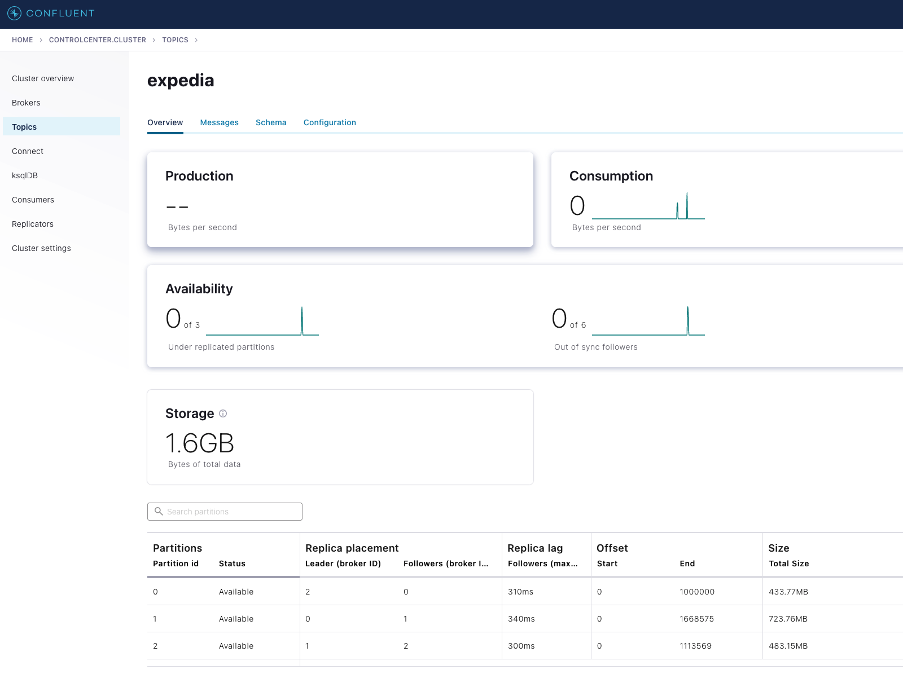
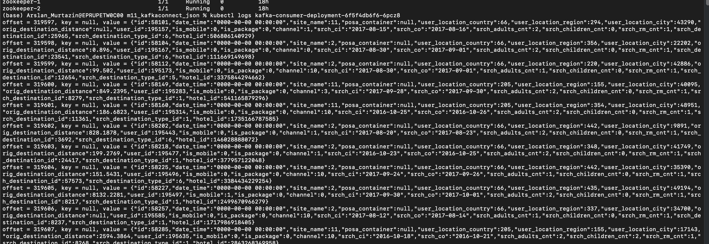

* Modify main.tf
    ```
      terraform {
      backend "azurerm" {
        subscription_id = <your_subscription_id>
        resource_group_name = <your_resource_group_name>
        storage_account_name = <your_storage_account_name>
        container_name = <your_container_name>
        key = <your_key>
      }
    }
    ```

* Deploy infrastructure with terraform
    ```
    terraform init
    terraform plan -out terraform.plan
    terraform apply terraform.plan
    ```

* Build new Azure Container Registry

* Build docker image for consumer(consumer/Dockerfile) and connector (connectors/Dockerfile)
    ```
    docker build -t <your(consumer/connector)docker>
    ```
  
* Login to Azure Container Registry
    ```
    az acr login -n <ACR_NAME>
    ```
  
* Push docker images to Azure Container Registry
    ```
    docker tag <your(consumer/connector)docker> <ACR_NAME>.azurecr.io/<your(consumer/connector)docker>
    docker push <ACR_NAME>.azurecr.io/<your(consumer/connector)docker>
    ```
  
* Connect to AKS
    ```
    az account set --subscription <$SUBSCRIPTION_ID>
    az aks get-credentials --resource-group <RESOURCE_GROUP> --name <NAME_OF_AKS>
    ```

* Attach ACR to AKS
    ```
    az aks update -n kubernetes-service-name -g <RESOURCE_GROUP> --attach-acr <ACR_NAME>
    ```

* Correct in confluent-platform.yaml application to your connector image in ACR
  
  

* Create the "confluent" namespace and make the namespace default
  ```
  kubectl create namespace confluent
  kubectl config set-context --current --namespace confluent
  ```

* Install confluent for Kubernetes
  
  ```
  helm repo add confluentinc https://packages.confluent.io/helm
  helm repo update
  
  helm upgrade --install confluent-operator confluentinc/confluent-for-kubernetes
  ```

* Deploy all the components mentioned above to the cluster
  ```
  kubectl apply -f confluent-platform.yaml
  ```

* Wait before the connect component will be ready to register the connector

* Create producer
  ```
  kubectl apply -f producer-app-data.yaml
  ```

* Upload expedia topic configuration
  ```
  CONNECT_HOST_NAME=$(kubectl get service connect-external -o jsonpath="{.status.loadBalancer.ingress[0].ip}")
  curl -s -X POST -H 'Content-Type: application/json' --data @connectors/azure_source_cc_expedia.json "$CONNECT_HOST_NAME:8083/connectors"
  ```

* Create consumer to read uploaded data from Kafka
  ```
  kubectl apply -f consumer.yaml
  ```


* Show logs to see the consumer is working
  ```
  kubectl logs <consumer_pod_name>
  ```

* Results
  
  Cluster
  
  

  Topics
  
  
  Expedia topic
  
  
  Cluaster pods
  
  
  Consumer log
  
  
  One log record example:
  ```
  offset = 319597, key = null, value = {"id":58101,"date_time":"0000-00-00 00:00:00","site_name":11,"posa_container":null,"user_location_country":66,"user_location_region":294,"user_location_city":43290,"orig_destination_distance":null,"user_id":195157,"is_mobile":0,"is_package":0,"channel":1,"srch_ci":"2017-08-15","srch_co":"2017-08-16","srch_adults_cnt":2,"srch_children_cnt":0,"srch_rm_cnt":1,"srch_destination_id":25965,"srch_destination_type_id":6,"hotel_id":506806140929}  
  ```